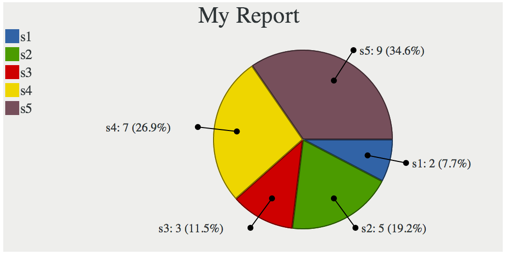

chartservice*
============

A PHP charting webservice for people who don’t want to write charts.  The goal ideologically is to be able to generate a chart by requesting the proper URL.  Currently utilizes Silex and the Zeta Components Graph component.

### Getting Started
* Clone repo into your webroot somewhere
* Perform a ```composer install``` inside the repo folder
* If you’re using something other than Apache, configure your rewrite rules to drive all traffic to **service.php**

That’s it.  You were expecting more?

### Basic usage ###

    </img>

Yields:



More to come…


\* I suck at naming things
